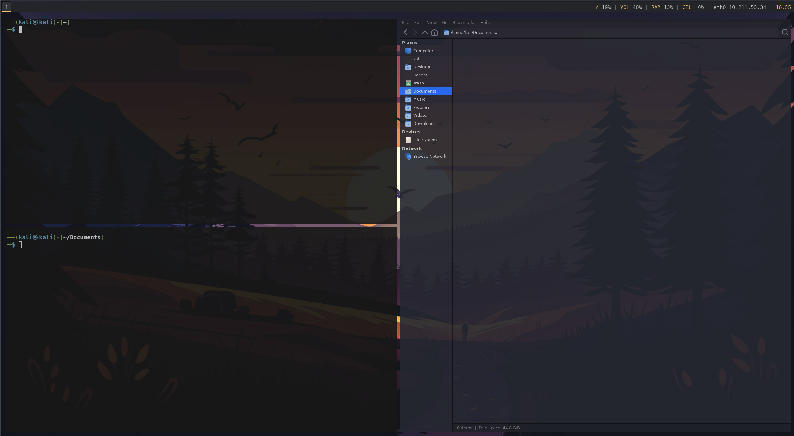

# Kali i3 Rice & Tools Setup

A minimal, automated setup for Kali Linux with i3wm – optimised for pentesting workflows.

  



## What's Included

### i3 Rice (`i3-rice.sh`)

- **i3wm** with gaps and borderless windows
- **Polybar** status bar with VPN module
- **Rofi** application launcher
- **Picom** compositor for transparency
- **Alacritty** terminal configuration
- **Dark GTK theme** for Thunar and other apps
- **LightDM** display manager

## Requirements

- Kali Linux (minimal install recommended – see the "Setup Minimal Kali Installation" section)
- ARM64 or x86_64 architecture
- Internet connection

## Installation

```bash

cd /tmp

# Clone the repository
git clone https://github.com/sud0x0/kali-setup
cd kali-setup

# Make scripts executable
chmod +x i3-rice.sh

# Run the scripts (do NOT use sudo)
./i3-rice.sh

# Reboot to apply changes
sudo reboot

# optional: this install the tools of my choice. GUI is required for this step.
# downloading the repository again, as /tmp instance is gone after the i3 installation.
cd Downloads
git clone https://github.com/sud0x0/kali-setup
cd kali-setup
chmod +x kali-tools-and-config.sh
./kali-tools-and-config.sh

# Reboot to apply changes
sudo reboot
```

## Post-Installation

1. **Select i3** at the login screen
2. **Choose a Rofi theme:** `rofi-theme-selector` (Material by Tomaszal recommended)
3. **Add your wallpaper:** Place an image at `~/.wallpaper/kali.jpg`

## Keybindings

| Key            | Action                 |
| -------------- | ---------------------- |
| `$mod+Enter`   | Open terminal          |
| `$mod+d`       | Open Rofi launcher     |
| `$mod+Shift+q` | Close window           |
| `$mod+v`       | Next window below      |
| `$mod+h`       | Next window right      |
| `$mod+f`       | Make window fullscreen |
| `$mod+Shift+r` | Reload i3              |

> `$mod` = Alt key (default)

## Customisation

- **i3 config:** `~/.config/i3/config`
- **Polybar:** `~/.config/polybar/config.ini`
- **Picom:** `~/.config/picom/picom.conf`
- **Alacritty:** `~/.config/alacritty/alacritty.toml`
- **Rofi:** `~/.config/rofi/config.rasi`

## Setup Minimal Kali Installation

1. Download the Kali image: https://www.kali.org/get-kali/#kali-installer-images
2. Install it in your VM or on bare metal
3. Select the graphical installation option
4. Under "Software Selection", untick all the desktop environments. Optionally, untick the tools as well if you prefer to install them manually.


## Other Notes

- The wallpaper is from [Freepik](https://www.freepik.com/free-ai-image/sunset-silhouettes-trees-mountains-generative-ai_39657505.htm#fromView=keyword&page=1&position=2&uuid=f467f087-c21e-4651-a4a1-d75dd4d6f397&query=1440p+nature+illustration+wallpaper)
- Tested in Parallels in Apple Silicon (ARM)
